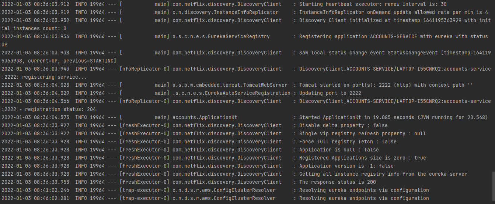
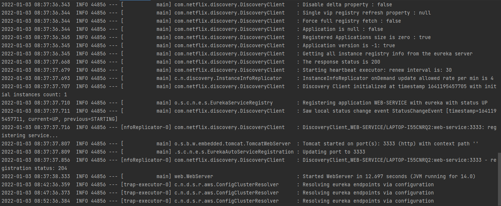
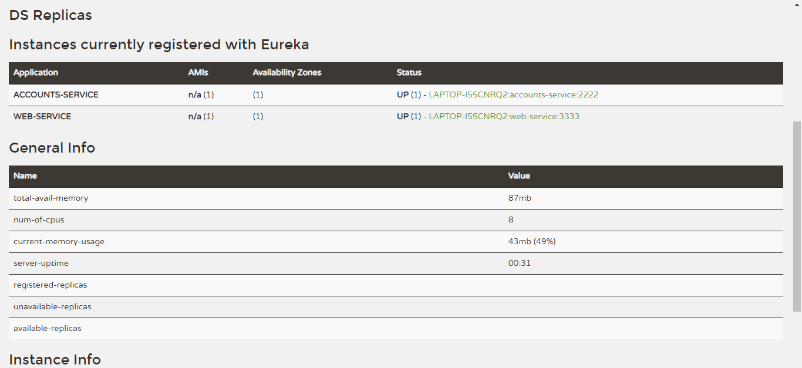
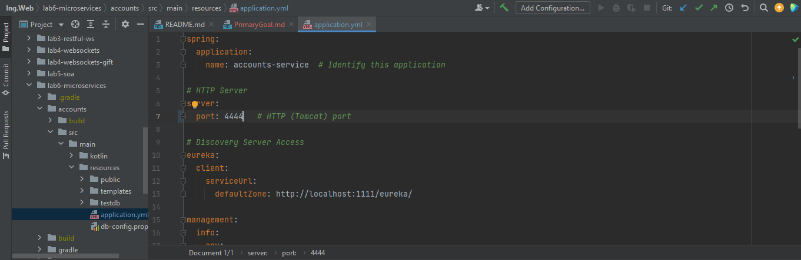
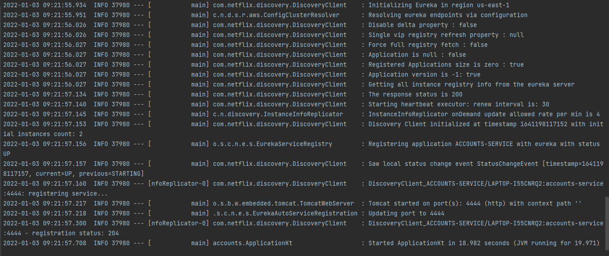
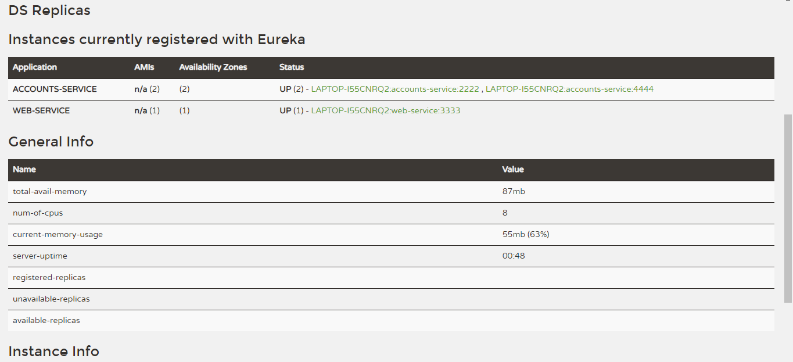
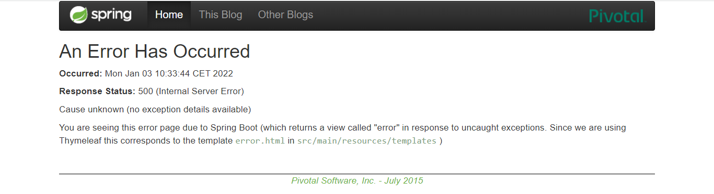
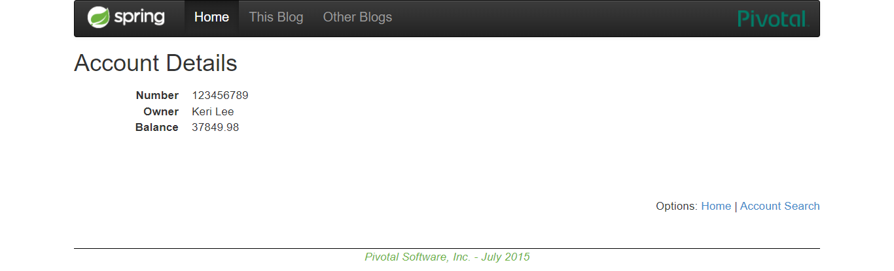

# Primary goal: Report

## First task: The two services accounts (2222) and web are running and registered (two terminals, logs screenshots).

The registration service must be run before the other services.
You can run all of the services by using the following commands in this order in different terminals:
```
./gradlew :registration:bootRun
./gradlew :accounts:bootRun
./gradlew :web:bootRun
```

The following screenshots show that the services are launched.

Account service log:


Web service log:


## Second task: The service registration service has these two services registered (a third terminal, dashboard screenshots)

When the services start running, they automatically register into Eureka service. 
So, I have checked that both services are registered in Eureka, accessing to Eureka
dashboard in order to check their status at http://localhost:1111.


## Third task: A second accounts service instance is started and will use the port 4444. This second accounts (4444) is also registered (a fourth terminal, log screenshots).
Now we are going to register a new account service. 
In this case we have to use the port 4444 instead of the port 2222 which
is currently used by other account service.

To do this, you have to change the port in accounts/src/main/resources/application.yml which
is port: 2222 to port: 4444 at line 7.

You can see the change in the following screenshot:


Now, we have to run a new accounts service.



After that, he dashboard shows 2 ACCOUNTS-SERVICE running and registered.
You can see this at eureka dashboard. The following screenshot shows that:



## Fourth task: What happens when you kill the service accounts (2222) and do requests to web? Can the web service provide information about the accounts again? Why?

Now, we have to kill the first account service which is at port 2222, so we click [Ctrl + C] at that terminal.
After killing the account service, it disappears from the registration service after a while.

The web service asks a different account service for each petition. So, when the service at port 2222 is killed, 
some petitions go to that port 2222 and other go to port 4444, so the first ones fail and the rest of them are correct. 
This occurs until the registration service discovers that one of them has failed and stops serving it.

When petitions are directed to the service with port 2222, there's an error. 
You can see the error in the following screenshot:


When the petitions go to the service with port 4444, the data is correctly displayed.
You can see that in the following screenshot:


Finally, the registration service stops serving the failed account service.
Now, we can see that at eureka dashboard which shows only the service at port 4444.


